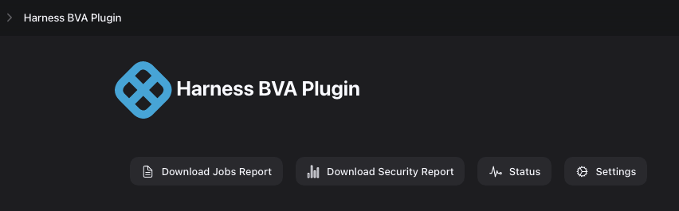

Harness BVA Plugin
=======================

## Introduction

Harness BVA plugin gathers stats for Job Runs. It also gathers information about security and configuration of the Jenkins Server.

For Job Runs it monitors information about Build Jobs, Deployment Jobs and Rollback Jobs.

## Getting started

### Installation

#### Installation using Plugin Store

In the future, the plugin will be available in the Plugin Store for install.

#### Manual Installation
The plugin is available at https://github.com/levelops/harness-bva/releases/latest

To install this plugin follow these steps
1) Sign-in to Jenkins and select Manage Jenkins.

2) Select “Manage Plugins”

3) Select the “Advanced settings” tag.

4) In the “Deploy Plugin” section ("Upload Plugin" in older Jenkins version), select “Choose File” to select the Harness BVA Plugin HPI file.

5) Select “Deploy” ("Upload" in older Jenkins version) to complete the plugin install.

6) Plugin install progress page will appear.

7) Once the plugin installation is complete, the status will change to “Success”.

### Configuration

1) Sign-in to Jenkins and select Manage Jenkins.

2) Select "Harness BVA Plugin".

3) Select "Settings".

4) Update "Plugins Directory" if required. The default location is "${JENKINS_HOME}/harness-bva". This needs to be set only if variable "${JENKINS_HOME}" is not set.

5) Configure Build Jobs.

6) Configure Deployment Jobs.

7) Configure Rollback Jobs.

7) Click Save.

## Status
1) Sign-in to Jenkins and select Manage Jenkins.
2) Select "Harness BVA Plugin".
3) Select "Status".

4) The Status page provides the timestamp of the latest Job Run monitored by the Plugin. Click "Close".

## Troubleshooting
1) Log into Jenkins 
2) Go to "Manage Jenkins". 
3) Click on "System Logs". 
4) Click "Add New Log Recorder". 
5) Add the name "Harness BVA Logs" and click "OK". 
6) Click "Loggers" -> "Add". 
7) In Logger enter "io.harness.plugins.harness_bva", set the "Log level" to "INFO", then click "ADD". 
8) Click "Save". 
9) See the logs.

## Issues

TODO Decide where you're going to host your issues, the default is Jenkins JIRA, but you can also enable GitHub issues,
If you use GitHub issues there's no need for this section; else add the following line:

Report issues and enhancements in the [Jenkins issue tracker](https://issues.jenkins-ci.org/).

## Contributing

TODO review the default [CONTRIBUTING](https://github.com/jenkinsci/.github/blob/master/CONTRIBUTING.md) file and make sure it is appropriate for your plugin, if not then add your own one adapted from the base file

Refer to our [contribution guidelines](https://github.com/jenkinsci/.github/blob/master/CONTRIBUTING.md)

## LICENSE

Licensed under MIT, see [LICENSE](LICENSE.md)

